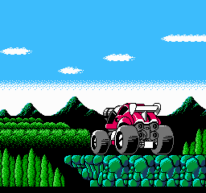
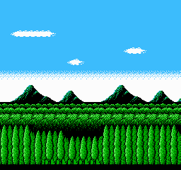

# NesTiler usage examples

[**nesasm CE**](https://github.com/ClusterM/nesasm) and **make** are required to compile those examples.

## nrom_simple
Very simple example with only one full screen image. Demo image is very simple and uses <256 tiles, so there are no need for any bankswitching.

## nrom_simple_offset
Same as **nrom_simple** but image is cropped, so attribute table bytes are displaced (**--attribute-table-y-offset-#** option).

## nrom_group_scroll
This example uses two images with shared pattern table (**--share-pattern-table** option), <256 tiles totally, so it's possible to scroll them.

## nrom_split
This example uses single image splitted in two horizontally, each part uses it's own pattern table, <256 tiles each. Base nametable switches during image rendering, so it's possible to use 512 tiles in total.

## nrom_split_lossy
Same as **nrom_split** but with сomplicated image that doesn't fit NES colors limitations, so NesTiler tries to optimize it and dismiss some palettes and colors (**--lossy 3** option).

 -> 

## mmc3_split4
This example uses single image splitted into four horizontally. Each part uses it's own pattern table, <256 tiles each. MMC3 IRQs and bankswitching used to switch pattern tables on the respective lines, so it's possible to remove 256 tiles limitation at all. This example contains tricky code to avoid visual artefacts.

## mmc3_split2_animation 
Full screen animation. Two images splitted into two parts horizontally. MMC3 IRQs and bankswitching used to switch pattern tables on the respective lines.

## sprites8x8
Simple 8x8 sprites example. Also, this example shows how sprites with different colors combined into single palette.

## sprites8x16
Simple 8x16 sprites example.
